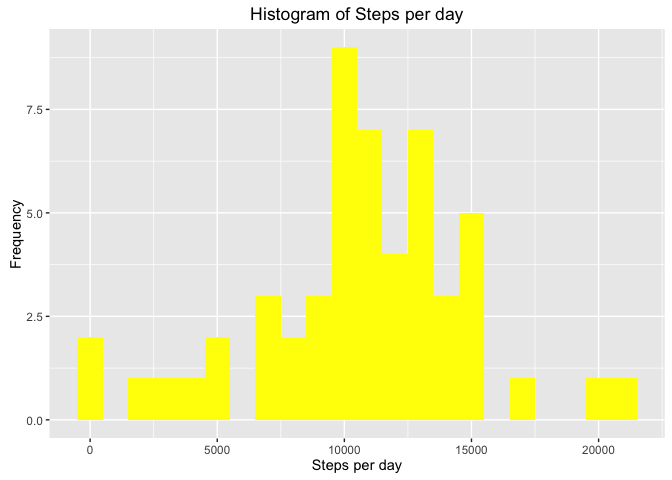
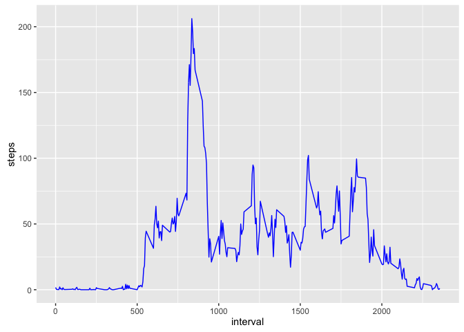
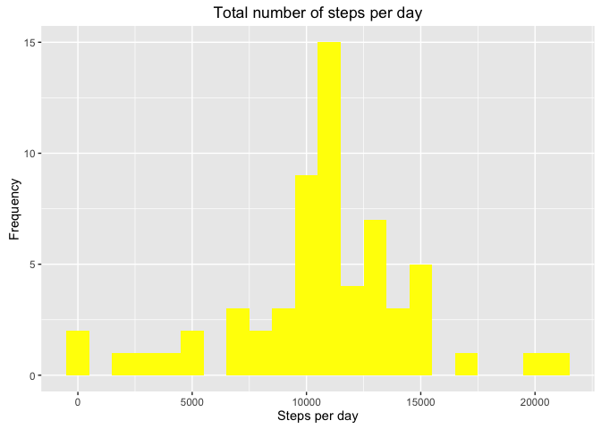
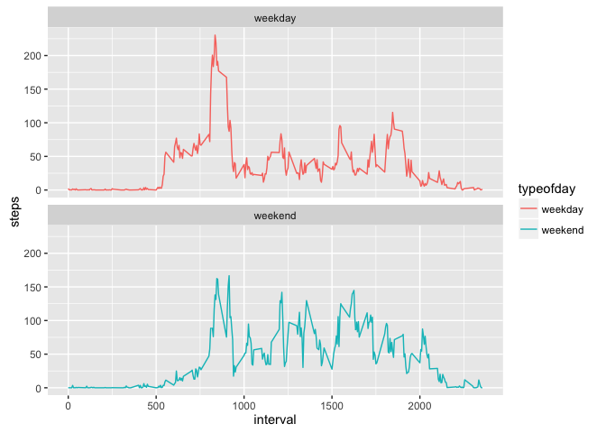

# Reproducible Research Course Project 1
Leonardo Lopez  
May 10th, 2016  

#Introduction 
This assignment makes use of data from a personal activity monitoring device. This device collects data at 5 minute intervals through out the day. The data consists of two months of data from an anonymous individual collected during the months of October and November, 2012 and include the number of steps taken in 5 minute intervals each day.

##Requirements  
In order to reproduce the research done make sure you load the following packages and 
always use `echo = TRUE` so that someone else will be able to read the code. 


```r
library(knitr)
library(dplyr)
```

```
## 
## Attaching package: 'dplyr'
```

```
## The following objects are masked from 'package:stats':
## 
##     filter, lag
```

```
## The following objects are masked from 'package:base':
## 
##     intersect, setdiff, setequal, union
```

```r
library(lubridate)
library(ggplot2)
```

```
## Warning: package 'ggplot2' was built under R version 3.2.4
```

```r
opts_chunk$set(echo = TRUE)
```

#Loading and preprocessing the data
The data is loaded using the `read.csv ()`assuming you have downloaded the activity.csv and saved it 
in your working directory. If not, please download it [here](https://d396qusza40orc.cloudfront.net/repdata%2Fdata%2Factivity.zip).

##Loading the data

```r
data <- read.csv("activity.csv", header = TRUE, sep = ',', colClasses = c("numeric", 
                                                                "character", "integer"))
```

##Preprocessing the data
Change the dateformat using `lubridate`

```r
data$date <- ymd(data$date)
```

Review data using `str`

```r
str(data)
```

```
## 'data.frame':	17568 obs. of  3 variables:
##  $ steps   : num  NA NA NA NA NA NA NA NA NA NA ...
##  $ date    : POSIXct, format: "2012-10-01" "2012-10-01" ...
##  $ interval: int  0 5 10 15 20 25 30 35 40 45 ...
```

#Data Analysis

##What is mean total number of steps taken per day?
For this part of the analysis, you can ignore the missing values in the dataset.

1. Calculate the total number of steps taken per day:  
Calculate the total number of steps per day using `dplyr` and group by `date`.

```r
steps <- data %>%
  filter(!is.na(steps)) %>%
  group_by(date) %>%
  summarize(steps = sum(steps)) %>%
  print
```

```
## Source: local data frame [53 x 2]
## 
##          date steps
##        (time) (dbl)
## 1  2012-10-02   126
## 2  2012-10-03 11352
## 3  2012-10-04 12116
## 4  2012-10-05 13294
## 5  2012-10-06 15420
## 6  2012-10-07 11015
## 7  2012-10-09 12811
## 8  2012-10-10  9900
## 9  2012-10-11 10304
## 10 2012-10-12 17382
## ..        ...   ...
```

2. Make a histogram of the total number of steps taken each day  

```r
ggplot(steps, aes(x = steps)) +
  geom_histogram(fill = "yellow", binwidth = 1000) +
  labs(title = "Histogram of Steps per day", x = "Steps per day", y = "Frequency")
```



3. Calculate and report the mean and median of the total number of steps taken per day  

```r
mean_steps <- mean(steps$steps, na.rm = TRUE)
median_steps <- median(steps$steps, na.rm = TRUE)
```

```r
mean_steps
```

```
## [1] 10766.19
```

```r
median_steps
```

```
## [1] 10765
```
Mean steps taken per day 10,766.19  
Median steps taken per day 10765  

##What is the average daily activity pattern?  

1. Time series plot of the 5-minute interval (x-axis) and the average number of steps taken,
averaged across all days (y-axis).  

Calculate the average number of steps taken in each 5-minute interval using 
`dplyr` and group by `interval`:


```r
interval <- data %>%
  filter(!is.na(steps)) %>%
  group_by(interval) %>%
  summarize(steps = mean(steps))
```
Using `ggplot`create the plot

```r
ggplot(interval, aes(x=interval, y=steps)) +
  geom_line(color = "blue")
```



2. Which 5-minute interval, on average across all the days in the dataset, contains 
the maximum number of steps?


```r
interval[which.max(interval$steps),]
```

```
## Source: local data frame [1 x 2]
## 
##   interval    steps
##      (int)    (dbl)
## 1      835 206.1698
```

As seen in the graphic, interval 835 contains the max number of steps 206

##Imputing missing values

Note that there are a number of days/intervals where there are missing values (coded as 𝙽𝙰).
The presence of missing days may introduce bias into some calculations or summaries
of the data.

1. Calculate and report the total number of missing values in the dataset 
(i.e. the total number of rows with 𝙽𝙰s)


```r
sum(is.na(data$steps))
```

```
## [1] 2304
```
The number of NAs is 2304  

2. Devise a strategy for filling in all of the missing values in the dataset: 
In this case `NAs` will be filled by the mean of steps in the same 5 min interval

3. Create a new dataset that is equal to the original dataset but with the missing 
data filled in.


```r
data_full <- data
nas <- is.na(data_full$steps)
avg_interval <- tapply(data_full$steps, data_full$interval, mean, na.rm=TRUE, simplify=TRUE)
data_full$steps[nas] <- avg_interval[as.character(data_full$interval[nas])]
```

4. Make a histogram of the total number of steps taken each day and calculate and 
report the mean and median total number of steps taken per day. 


```r
steps_full <- data_full %>%
  filter(!is.na(steps)) %>%
  group_by(date) %>%
  summarize(steps = sum(steps))
 ggplot(steps_full, aes(x = steps)) +
  geom_histogram(fill = "yellow", binwidth = 1000) +
  labs(title = "Total number of steps per day", x = "Steps per day", y = "Frequency")  
```



```r
mean_steps_full <- mean(steps_full$steps, na.rm = TRUE)
  mean_steps_full
```

```
## [1] 10766.19
```

```r
median_steps_full <- median(steps_full$steps, na.rm = TRUE)
  median_steps_full
```

```
## [1] 10766.19
```

**Do these values differ from the estimates from the first part of the assignment?**  

There is only a difference of 1 in the Median steps

**What is the impact of imputing missing data on the estimates of the total daily number of steps?**

Not a significant impact in this particular case   

##Are there differences in activity patterns between weekdays and weekends?

For this part the `weekdays()` function may be of some help here. Use the dataset 
with the filled-in missing values for this part.  

1. Create a new factor variable in the dataset with two levels – “weekday” and “weekend” indicating whether a given date is a weekday or weekend day.


```r
data_full <- mutate(data_full, typeofday = ifelse(weekdays(data_full$date) == "Saturday" | weekdays(data_full$date) == "Sunday", "weekend", "weekday"))
data_full$typeofday <- as.factor(data_full$typeofday)
```

2. Make a panel plot containing a time series plot of the 5-minute interval (x-axis) and the average number of steps taken, averaged across all weekday days or weekend days (y-axis).   


```r
interval_full <- data_full %>%
  group_by(interval, typeofday) %>%
  summarise(steps = mean(steps))
ggplot(interval_full, aes(x=interval, y=steps, color = typeofday)) +
  geom_line() +
  facet_wrap(~typeofday, ncol = 1, nrow=2)
```



As seen in the graphics above, subjects are more active early during the weekdays. However, 
activity seems to be more constant during the weekend. Blame it on the office jobs! 
